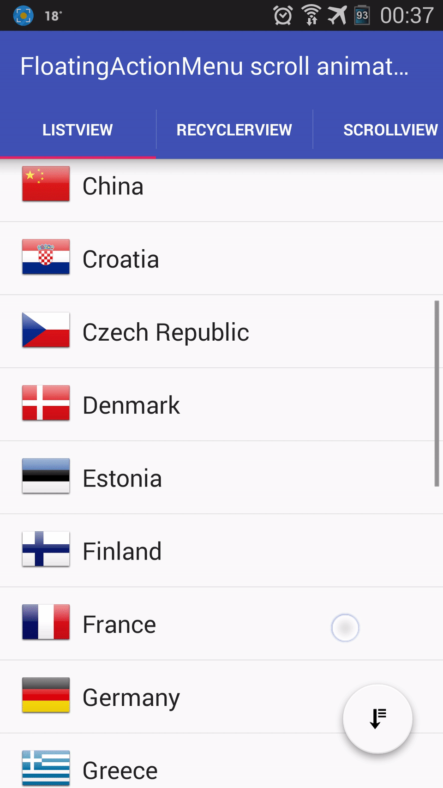

FloatingActionButtonX
====================
This library is an extended version of the [FloatingActionButton](https://github.com/str4d/android-floating-action-button) library by [str4d](https://github.com/str4d) with adding Scroll handler and animation for floatingActionMenu button with support for Android-X.
This library supports API 11+.

Features
========
* Support all features from its' base version: [FloatingActionButton](https://github.com/str4d/android-floating-action-button)
* Using custom FloatingActionMenu icon (default is add button): 
 *fab:fab_menuIcon="@drawable/sort"
* Scroll handler listener custom and animations: scale, translationY, translationX, fade

    Scale:

    
  
    TranslationY:  

    

Usage
=====
Add jitpack in your root build.gradle at the end of repositories:
```groovy
allprojects {
    repositories {
	    ...
		maven { url 'https://jitpack.io' }
	}
}
```
Add the dependency to your app module build.gradle
```groovy
dependencies {
	implementation 'com.github.Lennoard:FloatingActionMenu-Animation:1.10.1-alpha1'
}
```
Add these lines to proguard, make sure that RotatingDrawable run well:
```groovy
-keepclassmembers class toan.android.floatingactionmenu.FloatingActionsMenu$RotatingDrawable {
   void set*(***);
   *** get*();
}
```


Credits
=======
This library is an extended version of the [FloatingActionButton](https://github.com/str4d/android-floating-action-button) library by [str4d](https://github.com/str4d).

That library used [FloatingActionButton](https://github.com/makovkastar/FloatingActionButton) library by [Oleksandr Melnykov](https://github.com/makovkastar) as a base for development for handler of scroll.

License
=======
    Copyright (C) 2016 toanvc
    Copyright (C) 2014 str4d
    Copyright (C) 2014 Jerzy Chalupski

    Licensed under the Apache License, Version 2.0 (the "License");
    you may not use this file except in compliance with the License.
    You may obtain a copy of the License at

         http://www.apache.org/licenses/LICENSE-2.0

    Unless required by applicable law or agreed to in writing, software
    distributed under the License is distributed on an "AS IS" BASIS,
    WITHOUT WARRANTIES OR CONDITIONS OF ANY KIND, either express or implied.
    See the License for the specific language governing permissions and
    limitations under the License.
